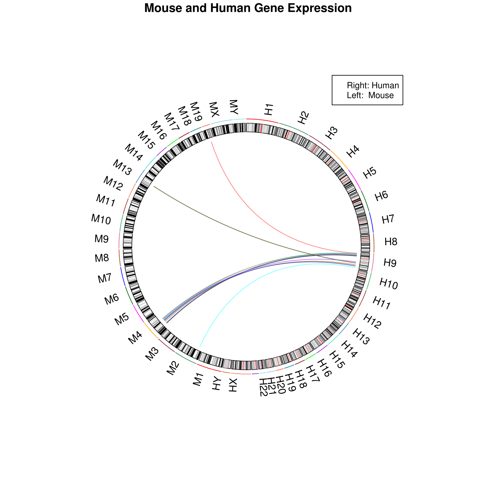

```{r, setup, include = FALSE}
knitr::opts_chunk$set(
    collapse = TRUE,
    comment = "#>"
)
```


## Table of Contents
* [Introduction](#introduction) 
* [Dependencies](#Dependencies)  
* [Install Packages](#Install Packages) 
* [Overview](#Overview)
    + [Input arguments for getCluster](#Input arguments for getCluster)
    + [Output of getCluster](#Output of getCluster)
    + [Input arguments for mapCluster](#Input arguments for mapCluster)
    + [Output of mapCluster](#Output of mapCluster)
* [Example on Clustering](#Example on Clustering)  
* [Example on Mapping](#Example on Mapping)  
* [Parallelism](#Parallelism)  
* [Plotting Mapped Clusters using Rcircos](#Plotting Mapped Clusters using Rcircos)  
* [Session Info](#Session Info)


## <a id="introduction"></a> Introduction

Biological information encoded in the DNA sequene is often organized into
independent modules or clusters. For instance, the eukaryotic system of
expression relies on combinations of homotypic or heterotypic transcription
factors (TFs) which play an important role in activating and repressing
target genes.

In disease state, genomics regions with increased mutational hotspots are
associated with disease initiation and progression.

fcScan is a package designed to detect clusters of genomic features based on 
user defined search criteria. Such criteria include:  
    
* A list of BED/VCF files or a dataframe of input data
* The required window size of the clusters to identify
* The combination of features required from input files or dataframe
* The order of features required within identified clusters
* The distance required between each cluster   
* On which strand to build the clusters   
* On which chromosome to build the clusters   

Additionally, fcScan package contains a wrapper function around
*pslMap* from KentUtils allowing the user to detect orthologous regions
from identified clusters. 


## <a id="Dependencies"></a> Dependencies

fcScan requires the following packages to be installed for the 
usage of getCluster :

* **parallel**
* **doParallel**
* **foreach**
* **stats**
* **utils**

They can be installed as follows:
    
* **install.packages**("parallel")
* **install.packages**("doParallel")
* **install.packages**("foreach")
* **install.packages**("stats")
* **install.packages**("utils")


mapCluster requires to have "pslMap" and "bedToPsl" from kent utilities

kent utilities can be downloaded from the following
website [https://github.com/ENCODE-DCC/kentUtils]

It is impprtant to note that not all operating systems
support kent utils, and so the mapCluster functionality of fcScan will
not run on all operating systems. This does not affect the main function
in fcScan *getCluster* that aims at identifying clusters of genomic
features.

    
Chain files can be downloaded from  [http://hgdownload.cse.ucsc.edu/downloads.html]

Chrom.sizes file can be found at [http://hgdownload.soe.ucsc.edu/goldenPath/**/bigZips]

"**" Should be replaced by the species(ex. hg19) 
    
## <a id="Overview"></a> Overview

fcScan contains two main function, `getCluster` and `mapCluster`.

`getCluster` is responsible for building clusters based on 
user defined parameters, while detecting orthologous 
regions is done using `mapCluster`.


## <a id="Input arguments for getCluster"></a> Input arguments for getCluster


>`clusters = getCluster(x=c("~/project/fcScan/data/NANOG.bed","~/project/fcScan/data/TATA.bed"), w = 1500, c = c("NANOG"=1,"TATA"=2), greedy = TRUE, overlap = -5, s = "+", chr = "chr9")`


###### Input data (x)
The input for `getCluster` is given through the parameter `x`.
This function takes BED and VCF files (compressed or not). BED-12, BED-6, BED-4,
and Bed-3 file formats are valid.
There is no limit on the number of files the user can define.

Alternatively, `getCluster` accepts a data frame as input. In this case,
this data frame should have 5 columns containing the following.

* **chr** : Contains the chromosome name
* **start**: Contains start coordinates
* **end**: Contains end coordinates
* **strand**: Contains strand relative to each site
* **site** : Contains the family name relative to genomic site

```{r, echo=FALSE, results='asis'}
df <- data.frame(chr = c("chr1", "chr1", "chr1", "chr1", "chr1", "chr1"),
                 start = c(10, 17, 25, 27, 32, 41), 
                 end=c(15, 20, 30, 35, 40, 48),
                 strand = c("+", "+", "+", "+", "+", "+"),
                 site = c("1", "2", "2", "1", "3", "2"))

knitr::kable(df)
```

The *chr*, *start* and *end* columns are the relative position of each
feature/site.
The *site* column contains the ID of the site and will be used for clustering.
*start* and *end* columns are numeric while the rest are characters.

###### Window Size (w)
Window size is set using `w`, and this parameter defines the size of the
clusters.

###### Condition (c)
The clustering condition `c` defines the number and type of genomic data to 
search for in each cluster
`c = c("TATA" = 1, "GATA" = 2)`  
This searches for clusters with 3 sites, One *TATA* and two  *GATA*.

Another way of writing the condition is the following 
`x = ("TATA.bed","GATA.bed"), c = c(1,2)`  
Given 2 files, *TATA.bed* and *GATA.bed*, this condition states that the user is 
looking for clusters made from 1 TATA site and 2 GATA sites. The numbers 
given in the condition are relative to the order of the files given. 

In case a data frame is given instead of files, the user needs to **explicitly** 
define the site name along with the number relative to each site. 
Giving the condition as `c = c(1,2)` for a data frame will not be allowed.  
`x = dataFrame_of_sites, c = c("TATA" = 1, "GATA" = 2)`

######Chromosome(chr) and Strand(s)
By default, the clusters will be built on both strands and all chromosomes
unless specified by the user using the `chr` and `s` arguments to limit the
search on a specific chromosome or strand.

Users can choose to cluster on one specific chromosome `(chr = "chr1")`, or
on more than one chromosome `(chr = c("chr1","chr3","chr4"))`  
(Default of `chr` is **NULL**) meaning that clustering on all chromosomes 
will be performed.

The values allowd for `s` are the following : 

* **+** : Build clusters on +ve strand
* **-** :  Build clusters on -ve strand
* **.** : Clusters are not strand specific  
(Default of `s` is **.**)

###### Overlap(overlap)
The gap/overlap between adjacent clusters can be controled using the `overlap`
option.
When `overlap` is positive, adjacent clusters will be separated by a minimum
of the given value.
When negative, adjacent clusers will be allowed to overlap by the a maximum
of the given value.  
(Default is **0**)

###### Greedy vs Non-Greedy
`greedy` allows the user to control the number of genomic features found 
in clusters.

When `greedy = FALSE`, `getCluster` will build clusters having the required
window size and will label *TRUE* the ones that contain the exact number
and type of genomic data provided in the condition argument.
Clusters having the user defined window size but not satisfying
the condition will be labelled as *FALSE*.

`greedy = TRUE` will look for clusters having the required window size
and will label *TRUE* the ones that contain the required condition of the
genomic data or more. The rest will be labelled as *FALSE*.  
(Default is **TRUE**)


###### Order(order)
The `order` option allows the user to define the specific order for the
combination of sites required.  
(Default is **NULL**)

###### Number of cores(n_cores)
This parameter allows the user to control the number of cores used by 
`getCluster` when using parallel.  
(Default is **2**)

## <a id="Output of getCluster"></a> Output of getCluster

The output of `getCluster` is a data frame with fields containing:

* **chr**: The chromosome on which a cluster is found
* **start**: The start of the cluster
* **end**: The end of the cluster
* **size**: The size of the cluster
* **sites**: The combination of sites that defines the cluster
* **strand**: The strand of the cluster, if any
* **isCluster**: A logical indicating if the cluster is TRUE or FALSE
* **reason**: Describes the reason behind the rejection of a cluster 

The algorithm returns all clusters containing the correct count of
sites/features. If the combination, overlap, and order options are satisfied,
the cluter is considered a `TRUE` cluster. 

NOTE: If the user is using `greedy = FALSE` and `order` contains values more
than  in the condition parameter (`c`),  an error will be raised.
However, if `greedy = TRUE`, then using `order` with more values than the 
condition paramerter is allowed since a greedy cluster may contain more 
sites than the required condition.

## <a id="Input arguments for mapCluster"></a> Input arguments for mapCluster

`mapCluster` function is a wrapper around kent utility *pslMap*, mostly 
adapted for identifying orthologous regions for distantly related species.
It is required to have `pslMap` and `bedToPsl` from KentUtils installed in
order to use `mapCluster`.
The path to kent utils can be given as arguments unless they are in
the system path.
Additionally, this function requires a chain file for species
the user wants to map.

###### Input data(x)

The input for mapCluster is a dataframe that follows a BED-6 format.  
            *chr   start   end name    score   strand *

###### Path to kent utils(kent)
The path to kent utils is passed using this parameter.
In case kent utils is in the system path then no need to for the path.  
(Default is **NULL**)

###### Chromosome Sizes file & Chain file
Path to the files should be passed through these arguments.


## <a id="Output of mapCluster"></a> Output of mapCluster

The output of `mapCluster` is a data frame containing the orthologous region
relative to each cluster.

It contains 8 columns:

* mappedTName
* mappedTStart
* mappedTEnd
* mappedStrand
* srcTName
* srcTStart
* srcTEnd
* srcStrand

## <a id = "Example on Clustering"></a> Example on Clustering

Following will be an example of how to use `getCluster` function.
This is an example of a data frame given instead of files.

The data can be downloaded from the following link [http://compbio.mit.edu/encode-motifs/]

This contains all known and discovered motifs for the ENCODE TFChIP-seq datasets

In this example, `getCluster` was performed on the NANOG_known1 motif
and TATA_known2 motif.

*motif.txt* is a large file so it would be more efficient to handle
it from the terminal  using bash or any other alternative to extract the
required sites.


To get the sites for each motif :
    
    
> `grep -i "NANOG_known1" matches.txt > "NANOG_known1.txt"`  
> `grep -i "TATA_known2" matches.txt > "TATA_known2.txt"`

Read each file into R

> `NANOG = read.table("/home/gk39/tmp/NANOG_known1.txt", stringsAsFactors = FALSE)`  
> `TATA = read.table("/home/gk39/tmp/TATA_known2.txt", stringsAsFactors = FALSE)`

Rearrange the columns to have the required data frame

> `TATA = TATA[,c("V2","V3","V4","V5","V1")]`  
> `NANOG = NANOG[,c("V2","V3","V4","V5","V1")]`  
> `head(TATA)`

```{r, echo=FALSE, results='asis'}
df <- data.frame(chr =  c("chr1", "chr1", "chr1", "chr1", "chr1", 
                            "chr1"), 
                 start = c(25705L, 65916L, 119982L, 167008L, 266303L, 343330L), 
                 end = c(25719L, 65930L, 119996L, 167022L, 266317L, 343344L), 
                 strand = c("+", "-", "-", "+", "-", "+"),
                 site = c("TATA_known2", "TATA_known2", "TATA_known2", 
                          "TATA_known2", "TATA_known2", 
                          "TATA_known2"))

knitr::kable(df)
```

>`head(NANOG)`

```{r, echo=FALSE, results='asis'}
df <- data.frame(chr = c("chr1", "chr1", "chr1", "chr1", "chr1", "chr1"), 
                 start = c(89192L, 93669L, 235753L, 239997L, 363873L, 415307L), 
                 end = c(89203L, 93680L, 235764L, 240008L, 363884L, 415318L), 
                 strand = c("+", "+", "+", "+", "-", "-"), 
                 site = c("NANOG_known1", "NANOG_known1", "NANOG_known1", 
                          "NANOG_known1", "NANOG_known1", "NANOG_known1"))

knitr::kable(df)
```

>`x = rbind(TATA,NANOG)`  
>`colnames(x) = c("chr","start","end","strand","site")`


In the example below `getCluster` will search for clusters that contain a
minimum of 1 NANOG_known1 site and 2 TATA_known2 sites, found within 1000bp
(since greedy is set to TRUE by default),
and adjacent clusters should be seperated by a maximum of 5 overlapping base
pairs.
Since `chr` has the value `chr9` and `s` has the value `+`, clusters will
only be built on chromosome 9 only and for sites defined on the positive strand
exclusively.

>`clusters = getCluster(x , w = 20000 , c = c("NANOG_known1" = 1, "TATA_known2" = 2 ), overlap = -5, chr = "chr9", s = "+")`

The results are stored in a data frame named clusters. *clusters* contains 
1606 observations with 10 variables


>`head(clusters)`

```{r, echo=FALSE, results='asis'}
df <- data.frame(chr = c("chr9", "chr9", "chr9", "chr9", "chr9", "chr9"), 
                 start = c(25818, 165838, 202789, 253853, 361625, 
                           387687), 
                 end = c(25832, 165852, 202800, 253867, 361639,
                         387701), 
                 clusterSize = c("14", "14", "11", "14", "14", "14"), 
                 site = c("TATA_known2", "TATA_known2", "NANOG_known1", 
                          "TATA_known2", "TATA_known2", "TATA_known2"), 
                 strand = c("+", "+", "+", "+", "+", "+"), 
                 isCluster = c("FALSE", "FALSE", "FALSE", "FALSE", "FALSE",
                               "FALSE"),
                  status = c("combnFail", "combnFail", "combnFail", 
                    "combnFail", "combnFail", "combnFail"),
                 id = c("c1", "c2", "c3", "c4", "c5", "c6"),
                    score = c(1, 1, 1, 1, 1, 1))

knitr::kable(df)
```

The resulting data frame will contain the *TRUE* and *FALSE* labelled 
clusters. To get only the cluster labelled by *TRUE*
We can subset by the following:
    
> `clusters_TRUE = subset(clusters, isCluster)`  
> `head(clusters_TRUE)`


```{r, echo=FALSE, results='asis'}
df <- data.frame(chr = c("chr9", "chr9", "chr9", "chr9", "chr9", "chr9"), 
                 start = c(5831141, 9319579, 16533736, 21748099,
                           23403001, 23714517), 
                 end = c(5846962, 9331595, 16549756, 21753346,
                         23415107, 23728984), 
                 clusterSize = c("15821", "12016", "16020", "5247",
                                 "12106", "14467"), 
                 site = c("TATA_known2,TATA_known2,NANOG_known1",
                          "NANOG_known1,TATA_known2,TATA_known2",
                          "TATA_known2,TATA_known2,NANOG_known1", 
                          "TATA_known2,NANOG_known1,TATA_known2",
                          "NANOG_known1,TATA_known2,TATA_known2", 
                          "TATA_known2,NANOG_known1,TATA_known2"), 
                 strand = c("+", "+", "+", "+", "+", "+"),
                isCluster = c("TRUE", "TRUE", "TRUE", "TRUE", "TRUE", "TRUE"), 
                 status = c("PASS", "PASS","PASS", "PASS", "PASS", "PASS"),
                 id = c("c94", "c138", "c253", "c331", "c347", "c354"),
                 score = c(1, 1, 1, 1, 1, 1))

knitr::kable(df)
```

*clusters_TRUE* contains 20 observations with 10 variables.


## <a id = "Example on Mapping"></a> Example on Mapping


Mapping will be done using the output of `getCluster`.
To map the clusters which satisfied all the user defined conditions, and thus 
are labelled *TRUE*.

> `clusters_TRUE = clusters_TRUE[,c("chr", "start", "end", "id", "score", "strand")]`
> `mappedClusters = mapCluster( clusters_TRUE , chrom.sizes = "hg19.chrom.sizes", chain = "hg19ToMm10.over.chain")`

The result of `mapClusters` is a data frame which contains 20 observations and 
8 variables.

```{r, echo=FALSE, results='asis'}
df <- data.frame(mappedTName = c("chr19", "chr4", "chr4", "chr4", 
                              "chr4", "chr4", "chr4", "chr4",
                              "chr4", "chr4", "chr4", "chr4", 
                              "chr4", "chr13", "chr13", "chr13",
                              "chr4", "chr4", "chr4", "chr2"
), 
mappedTStart = c(29646385L, 76914893L, 84373653L, 89096005L, 90906555L, 
          91272473L, 92895457L, 35596995L, 36196127L, 36932006L, 39138272L, 
          71162604L, 71231574L, 51843935L, 52807767L, 52864104L, 55687810L, 
          64208514L, 68827355L, 28663311L), 
 mappedTEnd = c(29664014L, 76930788L, 
    84386597L, 89099760L, 90918616L, 91279251L, 92912899L, 35625610L, 
    36211595L, 36949651L, 39159397L, 71167158L, 71260811L, 51860444L, 
    52818892L, 52879722L, 55701839L, 64238113L, 68850614L, 28670470L
          ), 
mappedStrand = c("+", "+", "+", "+", "+", "+", "+", "+", "+", "+", 
           "+", "+", "+", "+", "+", "+", "+", "+", "+", "-"), 
srcTName = c("chr9", 
             "chr9", "chr9", "chr9", "chr9", "chr9", "chr9", "chr9", "chr9", 
             "chr9", "chr9", "chr9", "chr9", "chr9", "chr9", "chr9", "chr9", 
             "chr9", "chr9", "chr9"), 
srcTStart = c(5831141L, 9319579L, 16533736L, 
              21748099L, 23403001L, 23714517L, 25254361L, 27890002L, 28420039L, 
              29192740L, 31384498L, 83422179L, 83497976L, 92216608L, 93938820L, 
              94030069L, 110452876L, 118041889L, 122001846L, 135788286L), 
srcTEnd = c(5846962L, 
        9331595L, 16549756L, 21753346L, 23415107L, 23728984L, 25268779L, 
        27899866L, 28433306L, 29211468L, 31402419L, 83435687L, 83517867L, 
        92234756L, 93955288L, 94048072L, 110465819L, 118057829L, 122020632L, 
                        135799106L), 
srcStrand = c("+", "+", "+", "+", "+", "+", "+", 
              "+", "+", "+", "+", "+", "+", "+", "+", "+", "+", "+", "+", "+"
))

knitr::kable(df)
```


In the example above, mapping was done from hg19 to Mm10.

*mappedTName mappedTStart mappedTEnd mappedStrand* are the representative
information of the mapped
regions in the mice species.

*srcTName srcTStart srcTEnd srcStrand* are the representative information of
the clustered regions.

The columns on the left represent the mapped orthologous regions corresponding
to the regions on the right.


## <a id="Parallelism"></a> Parallelism

This package uses parallelism by chromosome. One core will be allocated 
per chromosome. The number of cores is set to 2 by default.


## <a id = "Plotting Mapped Clusters using Rcircos"></a> Plotting Mapped Clusters using Rcircos

Using Rcircos, you can plot the resulting mapping from mapClusters.
*mappedClusters* is the data frame that contains the mapped clusters.

```
library(RCircos)
human.data = mappedClusters[,5:8]
mouse.data = mappedClusters[,1:4]
data(UCSC.Mouse.GRCm38.CytoBandIdeogram)
data(UCSC.HG19.Human.CytoBandIdeogram)

link.data <- data.frame(human.data[,1:3], mouse.data[,1:3])

species.list <- c("H", "M")

if(sum(link.data$mappedTName =="") != 0){ ##clusters which are not mapped
link.data = link.data[-which(link.data$mappedTName ==""),]
}

cyto.list <- list(UCSC.HG19.Human.CytoBandIdeogram,UCSC.Mouse.GRCm38.CytoBandIdeogram)
RCircos.Multiple.Species.Core.Components(cyto.list,species.list, NULL, 5, 5)
link.data[,1] <- paste(species.list[1], link.data[,1], sep="")
link.data[,4] <- paste(species.list[2], link.data[,4], sep="")
params <- RCircos.Get.Plot.Parameters()

params$chrom.width<-0.4
params$chrom.paddings <- 2000
params$base.per.unit <- 30000

RCircos.Set.Plot.Area()
par(mai=c(0.25, 0.25, 0.25, 0.25))

plot.new()
plot.window(c(-2.5,2.5), c(-2.5, 2.5))
RCircos.Chromosome.Ideogram.Plot()
track.num<-1
RCircos.Link.Plot(link.data, track.num, FALSE)
title(" Mouse and Human Gene Expression")
legend(1, 2, legend=c("Right: Human","Left:  Mouse"), cex=0.8)

```

```{r pressure, echo=FALSE, fig.cap="RCircos of Mapped Clusters", out.width = '100%'}

```


## <a id="Session Info"></a> Session Info


```{r} 
sessionInfo() 
``` 
